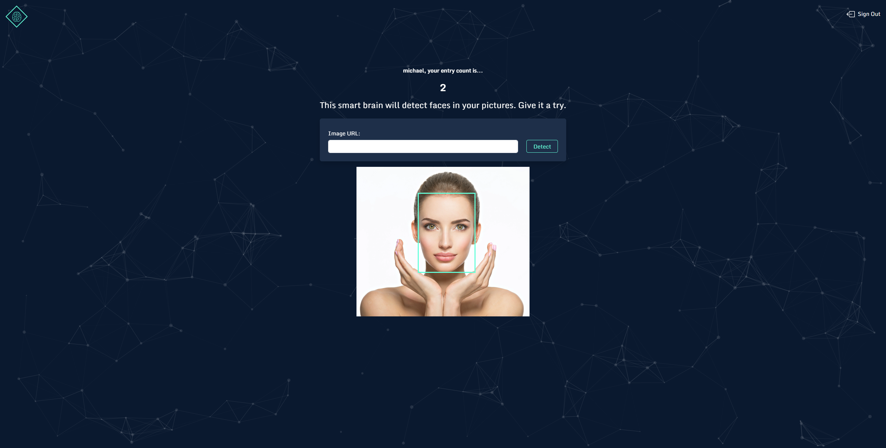

## 🧠 SmartBrain

This is a project based on [this amazing course](https://www.udemy.com/course/the-complete-web-developer-zero-to-mastery/) by Andrei Neagoie. It introduced me to all the modern technologies and tools in order to built full-stack applications.

This is the final application of the course. The difference is in the UI design and the frontend framework which is used - I built it with Angular whilst in the course it is built with React. The decision to go with Angular was based on my prior knowaldge of the framework.

## 🚀Technologies used
- Angular v14
- [Node.js + Express Backend API](https://github.com/dimitarradulov/smartbrain-api)
- PostgreSQL
- RxJS	
- TypeScript
- Bootstrap
- Clarifai API
- tsParticles

## ▶️Quick preview
You can check out the app here: <a href="https://smartbrain-seven.vercel.app/" target="_blank">SmartBrain</a> 
*(WARNING: Opens in the same tab)*

## 👩‍💻 Setup 
To run this project install it locally using npm:
```
$ git clone https://github.com/dimitarradulov/smartbrain.git
$ cd smartbrain
$ npm install
$ npm start
```
